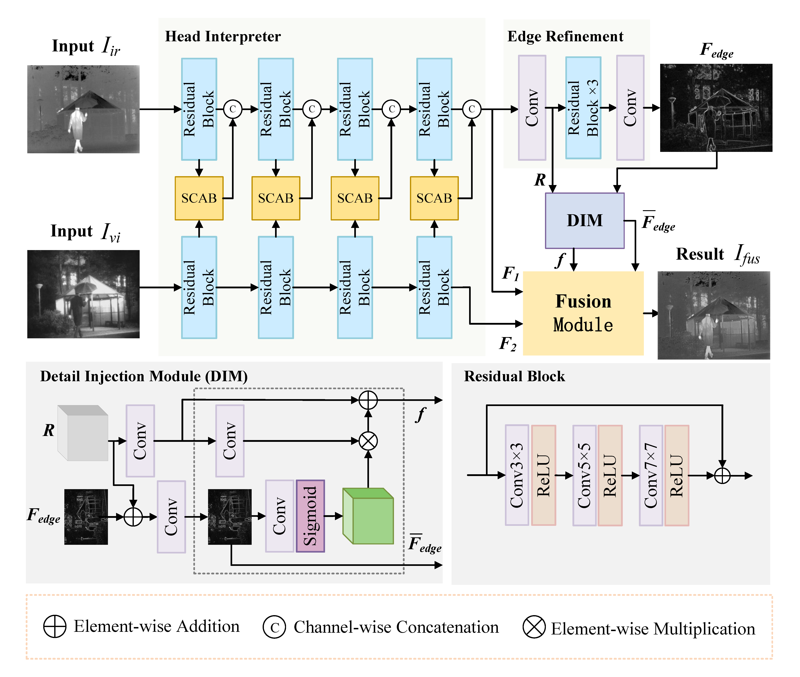

# ESFuse: Weak Edge Structure Perception Network for Infrared and Visible Image Fusion
## Abstract
Infrared and visible image fusion (IVIF) fully integrates the complementary 
features of different modal images, and the fused image provides a more 
comprehensive and objective interpretation of the scene compared to each source 
image, thus attracting extensive attention in the field of computer vision in 
recent years. However, current fusion methods usually center their attention on 
the extraction of prominent features, falling short of adequately safeguarding 
subtle and diminutive structures. To address this problem, we propose an end-to-end
unsupervised IVIF method (ESFuse), which effectively enhances fine edges and 
small structures. In particular, we introduce a two-branch head interpreter 
to extract features from source images of different modalities. Subsequently, 
these features are fed into the edge refinement module with the detail injection 
module (DIM) to obtain the edge detection results of the source image, improving 
the network’s ability to capture and retain complex details as well as global 
information. Finally, we implemented a multiscale feature reconstruction module 
to obtain the final fusion results by combining the output of the DIM with the 
output of the head interpreter. Extensive IVIF fusion experiments on existing 
publicly available datasets show that the proposed ESFuse outperforms the 
state-of-the-art(SOTA) methods in both subjective vision and objective evaluation,
and our fusion results perform well in semantic segmentation, target detection, 
pose estimation and depth estimation tasks.
### [Paper](https://www.mdpi.com/2079-9292/13/20/4115) | [Code](https://github.com/lwy12345678/ESFuse) 




## Note
In 'train.py' and 'test/test.py' file, you will find how to run these codes.

We train our network using MSRS as input images which contains 1083 pairs 
images and all resize to 64×64 and RGB images are transformed to gray ones. 
Learning rate is 1×10^(-4). The batch size and epochs are 32 and 30, respectively. 
Our method is implemented with two RTX 3090.
## 1. Platform

Python 3.8  
Pytorch >= 1.12  

## 2. Dataset

| Dataset       | TNO                                               |                   RoadScene                    | MSRS | M3FD |
|---------------|---------------------------------------------------|:----------------------------------------------:|------|------|
| Download link | [Link](https://figshare.com/articles/dataset/TNO_Image_Fusion_Dataset/1008029) | [Link](https://github.com/hanna-xu/RoadScene)  |[Link](https://github.com/Linfeng-Tang/MSRS) | [Link]( 	https://github.com/JinyuanLiu-CV/TarDAL)|

## 3. Get start
You can use infrared and visible images to train/test our Fusion model:

       python train.py

       cd ./test
       python test.py

## 4. Experimental Results

Please download the fused images by our ESF:
*  [Fused_results on RoadScene](https://pan.baidu.com/s/1jWgVwk87LjtypYg697CyRg ) (code: bth9)
*  [Fused_results on TNO](https://pan.baidu.com/s/1m9eGXAu9UO2-biqKYweVJw ) (code: y6wl)
*  [Fused_results on MSRS](https://pan.baidu.com/s/1HVLjeAcOJ7EDuEUTH1D6-A ) (code: x7lx)
*  [Fused_results on M3FD](https://pan.baidu.com/s/15HsfFgapfmF5ftId2Tqe5w) (code: 8gef)

## Citation
If you find our work or dataset useful for your research, please cite our paper. 
```
@Article{electronics13204115,
AUTHOR = {Liu, Wuyang and Tan, Haishu and Cheng, Xiaoqi and Li, Xiaosong},
TITLE = {ESFuse: Weak Edge Structure Perception Network for Infrared and Visible Image Fusion},
JOURNAL = {Electronics},
VOLUME = {13},
YEAR = {2024},
NUMBER = {20},
ARTICLE-NUMBER = {4115},
URL = {https://www.mdpi.com/2079-9292/13/20/4115},
ISSN = {2079-9292},
DOI = {10.3390/electronics13204115}
}
```
If you have any question, please send email to 2112203023@stu.fosu.edu.cn. 
